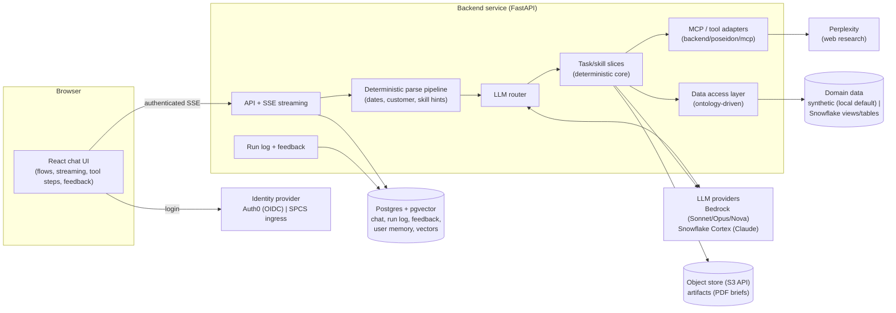

# 00 — System Overview

Status: Draft for review · Date: 2026-07-28 · Scope: full overhaul of Poseidon

## 1. What Poseidon becomes

Poseidon is rebuilt as a **chat-first sales-intelligence application** for marine fuel sales: a
general **ask-anything surface** over internal data plus external research — not a report app of
any fixed shape. A ChatGPT-style React interface replaces the Streamlit dashboard. Behind the
chat sits a **deterministic core**: Python functions do all data access, math, and formatting;
the LLM acts only as a **router/orchestrator** that selects skills and fills validated arguments
(the TM1-Finance-Agent-V2 philosophy).

### The three conversation flows

| Flow | Entry | What happens |
|------|-------|--------------|
| **Default chat** (no bubble) | free text; optional preset-skills picker | Conversational Q&A over the ontology-backed data skills — "what are my top GP customers for Port of Singapore in April 2026" returns data. Follow-ups can pivot to external research on a returned entity ("any relevant news on customer X I should be aware of?"), which invokes the web-research skill (Perplexity, marine-industry lens) like today's researcher agent. |
| **New Customer Prospect** (bubble) | company name | Today's prospect research flow produces the brief; the user can then pivot into internal data (e.g., which existing customers we already serve at a port named in the brief). |
| **Existing Customer** (bubble) | customer picker | Today's analytics suite runs and produces the brief; the user can then drill into internal detail (ports, lanes, metrics) and ask real-time external questions answered via Perplexity. |

**Design rule:** the chosen flow shapes the **entry orchestration only**. After the initial
deliverable, the full skill registry — internal data skills and research skills — is available
to the router in every flow, with carry-over context (active customer, port, period) maintained
by the deterministic conversation-state layer (doc 02 §5).

## 2. Goals

1. Conversational data Q&A over the certified ontology is a **core capability**, live in every
   flow — with web research (Perplexity, marine-industry lens) as its counterpart.
2. Preserve today's two agent flows (Contextualizer → Researcher → Strategist) end to end, as
   the entry orchestration of the two bubbles.
3. Chat UX with per-user history: list, reopen, continue, and start conversations.
4. Deterministic skill framework: every task is a self-contained directory of skills/tools.
5. Deterministic pre-parsing (dates, customer names, skill hints) before any LLM call.
6. Config-driven LLM tiering across **AWS Bedrock and Snowflake Cortex** behind one provider
   interface: Sonnet router, optional Opus supervisor, cheap tiers for grunt work.
7. Identity flow-through: verified identity propagates to every query (row-level security), chat
   persistence, and personalization — populated by Auth0 or SPCS ingress (doc 05).
8. Per-user personalization: a user system instruction and a distilled memory document, injected
   into router/synthesis prompts and editable by the user (docs 01/05).
9. Feedback capture on every assistant message, linked to the run log and harvested into the
   router-decision test pipeline (doc 06).
10. Observability from day one: the run log records every turn as a parent row plus one row per
    model call and tool call; router-decision tests are a first-class, in-repo test category.
11. Local-first: the entire system runs locally (docker-compose, synthetic data adapter — the
    standard local-development practice) and deploys as one container to **SPCS (primary)** and
    **EC2 (secondary)**; **Snowflake** is the production data platform.

## 3. Non-goals (this overhaul)

- No microservices. One modular backend service (modular monolith).
- No free-form LLM-generated SQL. All queries derive from the certified ontology (a guarded,
  additive text-to-SQL skill is a documented future path, doc 04 §7 — never a replacement).
- No fixed report product. mom-comparison contributes conversational mechanics (carry-over,
  validation, exact-value pass-through) — not its comparison-report product shape.
- No self-healing loop. Feedback is captured, stored, and harvested into tests; automatically
  acting on it is explicitly future work (doc 06 §7).

## 4. Architectural principles

| # | Principle | Consequence |
|---|-----------|-------------|
| P1 | LLM routes, Python computes | The model's only output surface is `(tool_name, args)` plus narrative prose. All numbers come from deterministic code. |
| P2 | Vertical slices | Code is organized by business capability (`tasks/<task>/skills/<skill>/`), not by technical layer. |
| P3 | Ontology as single source of truth | Schemas, metrics, guardrails, and synthetic data all derive from the certified `ontology.yml` semantic layer. |
| P4 | Zero trust at every gate | Identity verified at the edge (JWT signature, or the platform-injected SPCS ingress identity); LLM tool arguments validated by schema; dimension values whitelisted before touching SQL. |
| P5 | Presentation isolated from logic | The React UI renders typed message parts through a renderer registry and theme tokens; a restyle never touches business logic. |
| P6 | Evidence by construction | Every turn writes a run-log parent row plus one row per model and tool call; every skill returns a deterministic proof block; tests live in the repo and run from day one. |
| P7 | Config over code | Model tiers and providers, prompts, data backend, identity mode, and deploy target are configuration, swappable per environment. |

## 5. System context



## 6. Repository layout (target)

```
poseidon/
  frontend/            # React + TypeScript chat application (doc 01)
  backend/
    api/               # FastAPI routes, SSE, request middleware
    core/              # config, identity providers, db, structured logging, LLM providers
    chat/              # turn pipeline: parse -> route -> execute -> stream
    tasks/             # vertical slices: task -> skills -> tools/subskills (doc 02)
    mcp/               # external tool-server registry: mcp/<server>/ (doc 02 §7)
    observability/     # run-log writer, replay, token accounting, feedback (doc 06)
    tests/             # cross-cutting tests; skill tests live inside each skill
  ontology/            # certified ontology.yml + synthetic data profiles (doc 04)
  config/              # models.yml, env schema, prompt registry root (doc 03)
  infra/               # docker-compose, deploy scripts, runbooks (doc 07)
  docs/architecture/   # these documents
```

## 7. Provenance — what each source system contributes

| Source | Carried forward | Deliberately changed |
|--------|-----------------|----------------------|
| `latest_poseidon` (current app) | Both agent flows, agent prompts, Perplexity research schemas (marine-industry lens), metric definitions and period logic, PDF brief export, Auth0 role `Poseidon:Sales`, Cortex `claude-sonnet-4-5` usage | Streamlit UI replaced by React chat; Cortex retained as a first-class provider **alongside Bedrock** behind one interface; JWT now signature-verified; SQL now built from the ontology, parameterized |
| `mom-comparison` | Date carry-over semantics, period validation against available months, exact-value pass-through between turns, identifier-correction guardrails, "LLM narrates, pandas computes" — the conversational mechanics only, not the comparison-report product shape | Extraction moves from LLM-emitted sentinel blocks to deterministic Python pre-parsing; sentinel substring dispatch replaced by native tool calling |
| `TM1-Finance-Agent-V2` | Tool-schema registry pattern, provider router with normalized `ToolCall`/`LLMResponse`, conversation-buffer carry semantics, snapshot/property/stub-router test patterns, proof blocks, dual data backends behind one tool surface | Tests move into the repo (not gitignored); prompts move from inline constants to versioned config; a run-log table is written on every turn |
| `wfs_work_structure` | `ontology.yml` as the certified semantic layer: entities, metrics with exact SQL, negative constraints, business rules, per-app bindings; the proven **SPCS deployment pattern** (image repo + compute pool + service spec, `DEPLOY_MODE` session strategy, in-service state DB on a mounted volume, Cortex default in-platform, Auth0 `require_claims` gating) | The app consumes the ontology programmatically (loader) instead of hand-copying field dictionaries into code; app state is Postgres (RLS + pgvector), not SQLite |

## 8. Key decisions (summary; details in the numbered docs)

- D1 Backend is Python/FastAPI, one modular monolith — reuses the team's Python skill and TM1
  patterns; no microservices overhead.
- D2 The LLM router uses native function calling with schemas generated from Pydantic models —
  eliminates sentinel-string dispatch fragility observed in mom-comparison.
- D3 Subskills are orchestrated deterministically by their parent skill; the router never sees
  them — keeps the three-agent sequence stable and testable.
- D4 The data layer is an adapter interface (`DataClient`) with synthetic and Snowflake
  implementations selected by config — the whole app runs locally and the backend swaps later.
- D5 Postgres row-level security enforces per-user chat isolation in the database, not only in
  application code.
- D6 Tests, including router-decision tests, are committed to the repo and runnable from day one —
  explicit reversal of the TM1 gitignore practice, per project feedback.
- D7 Streaming uses Server-Sent Events, not WebSockets — unidirectional token/phase streaming is
  all the chat needs; simpler to operate behind a proxy.
- D8 (revised 2026-08-05) One container image, two deploy targets sharing one
  environment contract. **EC2 deploys first** (owner decision at Phase 13 closure: get a
  public, Auth0-gated instance live on proven AWS footing before the corporate-platform
  work); **SPCS remains the corporate primary target**, deployed after, with the
  Snowflake data backend onlined by a separate Snowflake-side effort. Dev/prod parity
  over premature scale-out, unchanged.
- D19 Flow = entry orchestration only; after the initial deliverable the router sees the full
  skill registry in every flow — pivots are the product, not an exception (doc 02 §4).
- D20 App state (chat, run log, feedback, user memory) is Postgres everywhere; in SPCS it runs
  as a second service container on a mounted block volume — mirrors the wfs in-service-DB
  evidence and keeps the RLS/pgvector schema identical across habitats (doc 07 §4).
- D21 LLM provider layer supports Bedrock and Snowflake Cortex behind one config-driven
  role→{provider, model} interface; SPCS-mode default is Cortex — zero external credentials
  in-platform, and the current app already runs Cortex `claude-sonnet-4-5` (doc 03 §1).
- D22 Identity is an abstraction (`auth0` | `spcs_ingress` | `disabled`) populating one
  `UserContext`; SPCS-mode default is SPCS ingress identity — the platform already
  authenticates Snowflake users, so a second login adds friction without gain (doc 05 §2).
- D23 Web research reaches Perplexity through a first-class MCP/tool-adapter layer; the direct
  API adapter is the default transport — it is the proven in-house path with schema-pinned
  structured output (doc 02 §7).
- D24 (superseded by D31) The per-user memory document is distilled at end of conversation
  (async, debounced) by a config-driven Sonnet tier (doc 05 §5).
- D25 Feedback (thumbs + comment) is stored linked to message and `turn_run` row and harvested
  into the router-decision suite; acting on it automatically is out of scope (doc 06 §7).
- D26 Every SSE event carries a `turn_id`/`message_id`/`event_seq` envelope and an `id:` line, and
  turn creation is idempotent via a client-generated `client_turn_key` — replay and crash recovery
  need every event to be self-addressed (doc 01 §5).
- D27 The run log is `turn_run` + append-only `llm_calls` and `tool_calls`, not one row per turn —
  a turn is N model calls, and only per-call rows can attribute cost and latency (doc 06 §1).
- D28 RLS context is transaction-scoped `set_config('app.user_sub', :sub, true)`, policies read it
  with `missing_ok`, owned tables `FORCE ROW LEVEL SECURITY` — a pooled connection must never
  inherit the previous user's context (doc 05 §4).
- D29 Retention windows are configuration with stated defaults; deleting a conversation
  hard-deletes its content and retains a redacted audit row — the right to delete and the audit
  obligation are both satisfied only by redaction (doc 05 §7).
- D30 Web-research calls carry entity names only, never internal metric values — the one call that
  leaves the boundary must not carry anything computed from the certified views (doc 05 §7).
- D31 (revises D24) Memory distillation is a durable outbox job fired after an explicit idle
  threshold with retries, storing typed attributed entries rendered to markdown at assembly and
  never derived from tool output — an in-process debounce loses work on restart, and free-text
  accumulation from external text is a poisoning vector (doc 05 §5).
- D32 The in-service Postgres and MinIO get scheduled logical backups shipped off-service, a
  rehearsed restore, and stated RPO/RTO — a mounted volume is not a backup (doc 07 §4).
- D33 Phase 5 ships Bedrock + stub; Cortex arrives in the SPCS phase's preparation with a
  provider-parity contract test — prove the seam with one live provider before paying for two
  (doc 03 §1, doc 08).

## 9. Document map

| Doc | Contents |
|-----|----------|
| 01-frontend | React chat architecture, flow entry UX, renderer registry, tool-step visibility, feedback UI, settings surface, streaming |
| 02-backend-skills | Task/skill folder convention, registry, contracts, parsing pipeline, flow mapping, MCP tool layer |
| 03-llm-routing | Bedrock + Cortex provider layer, model tier map, prompt assembly, prompts-as-config, router-decision testing |
| 04-data-ontology | Ontology catalog, `DataClient` interface, synthetic + Snowflake adapters, vector store, extensibility |
| 05-auth-identity | Identity providers (Auth0 / SPCS ingress), identity propagation, RLS, chat history, personalization data, privacy/retention/deletion and egress classification |
| 06-observability | Run-log schema (`turn_run` + `llm_calls` + `tool_calls`), audit/replay, token accounting, feedback capture, test taxonomy |
| 07-infrastructure | Local topology, SPCS (primary) and EC2 (secondary) targets, environment contract, trial-account setup path |
| 08-build-phases | Phased implementation plan with validation gates |
