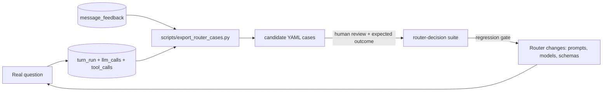

# 06 — Observability and AI-Decision Testing

Baked in from day one. Lessons applied: TM1 shipped with near-zero server logging and an error
table nothing called; mom-comparison shipped with zero tests. Neither happens here.

## 1. The run log (a parent turn row plus append-only call children)

"The run log" names three tables, not one. A turn is not a single model invocation: the router
iterates until it stops calling tools, each subskill synthesizes, and the utility tier titles the
conversation — a routine brief turn is a handful of model calls across two tiers. Recording that as
one row per turn collapses N calls into a summed token count and loses exactly the evidence needed
to explain a slow or expensive turn. So the parent **`turn_run`** carries the turn; **`llm_calls`**
and **`tool_calls`** are append-only children, one row per actual call.

Every chat turn — success, clarification, or failure — writes exactly one `turn_run`. Background
LLM runs (memory distillation, doc 05 §5) write one too, discriminated by `kind`, so every model
invocation in the system is accounted for in one place.

```sql
turn_run (
  id uuid primary key,                    -- UUIDv7; the turn_id referenced by messages and SSE
  kind text not null default 'chat_turn'
    check (kind in ('chat_turn','memory_update')),
  conversation_id uuid,                   -- null for runs not tied to one conversation
  message_id uuid,                        -- assistant message produced (null on hard failure
                                          --   and for memory_update runs)
  user_sub text not null,                 -- RLS: users see their own; admin role sees all
  client_turn_key uuid,                   -- client-generated (doc 01 §5); chat_turn only
  turn_index int,                         -- 1-based within conversation (chat_turn only)
  question text,                          -- user message, verbatim (chat_turn only; redactable)
  mode text,                              -- existing | prospect | default
  parsed jsonb not null default '{}',     -- ParsedTurn: periods, customer matches + confidence,
                                          --   skill hints, carry-ins (doc 02 §5); {} for
                                          --   non-chat kinds
  answer_summary text,                    -- final assistant narrative, capped (redactable)
  status text not null
    check (status in ('running','ok','clarify','error')),
  input_tokens int not null default 0,    -- rolled up from llm_calls at finalize
  output_tokens int not null default 0,
  latency_ms int,                         -- wall clock, accept -> done
  trace_id text,                          -- the request's trace id (§3)
  error jsonb,                            -- RFC-7807 problem detail on failure
  created_at timestamptz not null default now(),
  finished_at timestamptz,
  unique (user_sub, client_turn_key)      -- idempotent turn creation on client retry
);
llm_calls (
  id uuid primary key,                    -- UUIDv7
  turn_run_id uuid not null references turn_run(id) on delete cascade,
  user_sub text not null,                 -- denormalized for RLS locality
  seq int not null,                       -- 1-based order within the turn
  provider text not null,                 -- bedrock | cortex | stub
  model_id text not null,                 -- resolved provider model id
  role text not null,                     -- router | synthesis | supervisor | memory | utility
                                          --   | micro (doc 03 §2)
  prompt_version text not null,           -- version of the prompt file used (doc 03 §4)
  prompt_hash text not null,              -- hash of the rendered prompt actually sent
  input_tokens int not null default 0,
  output_tokens int not null default 0,
  latency_ms int,
  status text not null check (status in ('ok','error')),
  error jsonb,
  created_at timestamptz not null default now(),
  unique (turn_run_id, seq)
);
tool_calls (
  id uuid primary key,                    -- UUIDv7
  turn_run_id uuid not null references turn_run(id) on delete cascade,
  user_sub text not null,                 -- denormalized for RLS locality
  seq int not null,                       -- matches the SSE `tool` event's tool_seq (doc 01 §5)
  tool text not null,                     -- registered tool name
  server text,                            -- MCP server / adapter; null for in-process tools
  args jsonb not null,                    -- validated args, verbatim
  result_digest jsonb,                    -- row counts, checksums, artifact refs — never payloads
  status text not null check (status in ('ok','error')),
  latency_ms int,
  error jsonb,
  created_at timestamptz not null default now(),
  unique (turn_run_id, seq)
);
create index on turn_run (conversation_id, turn_index);
create index on turn_run (created_at);
create index on llm_calls (turn_run_id, seq);
create index on tool_calls (turn_run_id, seq);
```

Decision D27: one turn is N rows in `llm_calls`, not one summed field — per-call provider, model,
prompt version, tokens, and latency are the only way to attribute cost and diagnose a slow turn.

Write discipline: `turn_run` is inserted at turn start with `status='running'`; children are
appended as each call returns; finalize sets terminal status, `finished_at`, `latency_ms`, and the
token roll-up. The whole path is wrapped so a run-log failure can never break the user's answer
(TM1's CSV-writer rule) — but a run-log failure is itself logged at ERROR.

**Arrival:** a minimal writer for these three tables ships with the first live LLM call (doc 08
Phase 6), so every live turn is recorded from the first end-to-end conversation onward. The later
observability phase (doc 08 Phase 11) adds reconciliation, export/harvest, and cost roll-ups on
top of rows that already exist.

## 2. What the run log buys

1. **Audit trail** — who asked what, which model tiers ran in which order with which prompt
   version, which tools ran with which arguments, what came back, what it cost. `tool_calls.args`
   are verbatim; results are digests (row counts, checksums, artifact refs), keeping rows small
   while preserving the decision record.
2. **Restart/recovery** — the SSE client reconciles a dropped stream from
   `GET /api/turns/{turn_id}` (rebuilt from `turn_run` + children + `messages`); a crashed backend
   resumes conversations losslessly because state lives in Postgres, not process memory.
3. **Test harvesting** — real questions become router-decision tests (section 4).
4. **Cost accounting** — `llm_calls` rolls up by user/day/model/role/prompt version for a
   one-query cost view; a scheduled check flags anomalous per-turn token spikes. A prompt change
   is judged on the calls it actually made, not on a turn average.

## 3. Structured logging and tracing

- JSON logs only: `{ts, level, trace_id, turn_id, component, event, context}`. No bare prints.
- One `trace_id` per HTTP request, propagated through pipeline → router → skills → data client;
  returned as a response header and stamped on the `turn_run` row.
- Spans (lightweight timings, OpenTelemetry-compatible naming): `parse`, `route`,
  `skill:<id>`, `subskill:<id>`, `llm:<role>`, `db:query`, `ext:perplexity`. Durations land in
  `llm_calls.latency_ms` / `tool_calls.latency_ms` and the log stream.
- Health: `/health/live` (instant), `/health/ready` (DB + config checks). LLM providers are
  deliberately excluded from readiness — LLM-provider latency must not flap the instance.

## 4. Proof blocks (user-facing determinism)

Every skill result carries a deterministic `proof` part (TM1's byte-precise `_proof_block`
pattern): metric, entity, period window, filters applied, result-empty and did-you-mean notes,
data source (synthetic | snowflake), and artifact references. The proof is generated by code from
the executed spec — never by the model — and is rendered as a collapsible block in the chat
(doc 01 §4). Empty results state "Result: empty" and suppress narrative invention.

## 5. Test taxonomy (all committed, all runnable from day one)

| Level | Category | What it locks | Mechanism |
|-------|----------|---------------|-----------|
| L1 | Deterministic unit | parsers (dates/customer/hints), tools, query builder, synthetic generator | pytest; **SQL snapshot tests** byte-identical incl. error strings (TM1 pattern); property tests (e.g. GL volume-exclusion invariant); RLS isolation test (doc 05 §4) |
| L2 | Contract | registry ↔ schema parity; prompt contracts; ontology inventory pin; API DTOs; message-part kinds ↔ frontend registry | pytest + shared JSON fixtures consumed by frontend tests |
| L3 | **Router-decision** | "user asks X → router calls skill Y with args ⊇ Z" and clarify paths | stub mode (recorded `LLMResponse` fixtures, default) + live mode (`-m router_live` against the configured provider); details doc 03 §6 |
| L4 | End-to-end | both brief flows, synthetic data, stubbed LLM narratives; smoke with live models | pytest against the composed stack; Playwright UI smoke |

Rules: tests are never gitignored (decision D6); stub-mode L1–L3 run with zero credentials and
zero network so the default `pytest` is always green-or-meaningful; live suites are marker-gated.
Coverage floor per skill: 1 happy path, 2 edge cases, 1 failure case, plus at least 2 routing
cases (1 positive, 1 clarify/negative).

## 6. The harvest loop



Prompt edits, model-id bumps (Sonnet version changes), and schema changes must pass the
harvested suite — the router's behavior is pinned by evidence, not hope.

## 7. Feedback capture

Every assistant message carries thumbs up/down in the UI (doc 01 §8); thumbs-down opens a
"what went wrong" free-text prompt. Verdicts land here, joined to both the message and its
run-log row:

```sql
message_feedback (
  id uuid primary key,                    -- UUIDv7
  message_id uuid not null references messages(id) on delete cascade,
  run_id uuid not null references turn_run(id),
  user_sub text not null,                 -- RLS (doc 05 §4)
  verdict text not null check (verdict in ('up','down')),
  comment text,                           -- free text; thumbs-down prompt, optional
  created_at timestamptz not null default now(),
  unique (message_id, user_sub)           -- one verdict per user per message; upsert amends
);
```

What feedback buys (decision D25):

1. **Harvest priority** — `export_router_cases.py` exports thumbs-down rows first, with the
   full run context (question, parsed, the turn's tool and LLM calls, answer summary) and the
   user's comment attached;
   each becomes a candidate router-decision case after human review (§6, doc 03 §6).
2. **Quality accounting** — verdict rates roll up by skill, model role, and prompt version in
   one query, so a prompt or model change is judged against real user signal.

**Future work (explicitly out of scope):** a self-healing loop that acts on feedback
automatically — feedback in this overhaul is captured, stored, and harvested into tests only.
