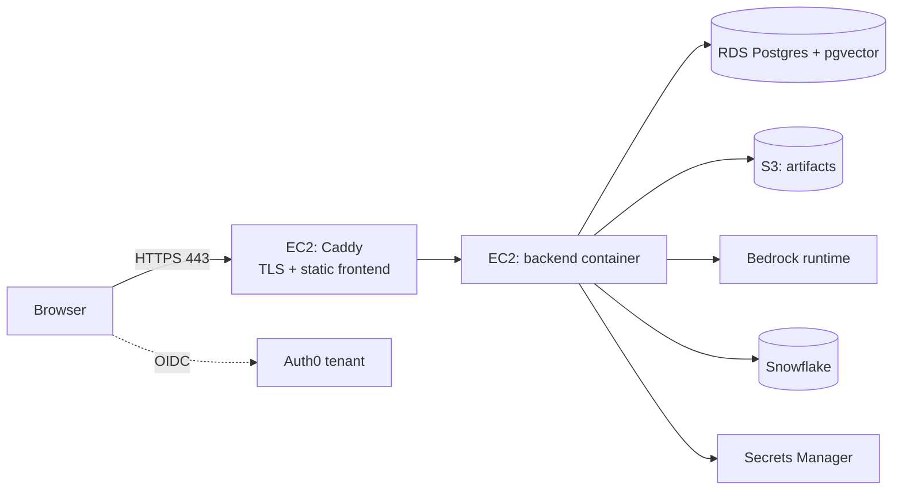

# 07 — Infrastructure: Local-First, Then EC2 (First-Deployed) and SPCS (Corporate Primary)

Principle: one architecture, one container image, one environment contract, three habitats.
Everything is developed and validated locally with docker-compose, then deployed unchanged to
**EC2 first** -- a public, Auth0-gated instance on proven AWS footing, brought up before the
corporate-platform work -- and then to **Snowpark Container Services (SPCS), the corporate
primary target**, following the proven in-house pattern. Only configuration differs (decision
D8, revised 2026-08-05).

## 1. Local development topology

```
docker-compose.yml
  db        postgres:16 + pgvector          ports 5432; schemas: app, synthetic
  minio     S3-compatible object store      ports 9000/9001; bucket: poseidon-artifacts
  backend   FastAPI (uvicorn, reload)       port 8000; depends_on db, minio
  worker    memory-distillation worker      no port; depends_on db (Phase 13 Task 4, D31)
  frontend  Vite dev server                 port 5173; proxies /api -> backend
```

- First run: `docker compose up` → migrations apply (Alembic) → synthetic dataset generates and
  loads into the `synthetic` schema (doc 04 §4 — the standard local-development practice) →
  app is fully usable at `localhost:5173`.
- `IDENTITY_MODE=disabled` by default locally (fixed dev user + `X-Dev-User` act-as, doc 05
  §2); flip to `auth0` to exercise the real login against a dev tenant.
- LLM: `LLM_PROFILE=bedrock` with an IAM user's keys in `.env` (section 6), or
  `LLM_PROFILE=cortex` with Snowflake credentials. `LLM_MODE=stub` (recorded responses;
  default for tests) keeps the stack usable with zero credentials.
- MinIO stands in for S3 behind the same `boto3` client (endpoint-url config) — artifact code
  is identical in every habitat.

## 2. The container contract

One multi-stage Dockerfile (mirrors the wfs table-chatbot pattern and the current corporate
image conventions):

- **Stage 1 (node):** `npm ci && npm run build` → `frontend/dist` static SPA bundle.
- **Stage 2 (python:3.12-slim or the corporate base image):** install requirements + WeasyPrint
  native libraries (Pango/Cairo — carried from the current Dockerfile); copy `backend/`,
  `ontology/`, `config/`, and `frontend/dist`; run as a non-root user; serve API **and** the
  built SPA from one origin/port with `uvicorn` on 8000 (StaticFiles mounted after all `/api/*`
  routes).

One image serves every target; behavior differences are environment variables only (section 6).
The existing corporate pipeline (Bitbucket → JFrog/ECR, `bitbucket-pipelines.yml`) consumes the
same image, so the corporate deployment path stays compatible by construction.

## 3. Deployment targets at a glance

| | SPCS (corporate-primary) | EC2 (first-deployed) |
|---|---|---|
| Runs as | multi-container **service** in a compute pool | docker-compose behind Caddy |
| Data platform access | Snowpark session via auto-mounted OAuth token | Snowpark session via Secrets Manager credentials |
| App state (Postgres) | managed **Snowflake Postgres**; `DATABASE_URL` injected from a Snowflake secret (D39, revises D20) | RDS Postgres + pgvector (D17) |
| Artifacts | **no object store in the service** — report HTML/PDF are bytes in Postgres, served through the API (D39) | S3 bucket + lifecycle rule |
| LLM default | Cortex (D21) | Bedrock via instance profile (D21) |
| Identity default | `spcs_ingress` (D22) | `auth0` |
| Outbound calls | External Access Integration (§4) | security-group egress |

## 4. SPCS deployment (corporate primary)

Mirrors the wfs_work_structure pattern (container-agent-app / table-chatbot archetypes) with
Poseidon's service shape:

| Component | Value (convention) |
|---|---|
| Image repository | `SANDBOX.MCA.POSEIDON_REPO` |
| Registry URL | `<org>-<acct>.registry.snowflakecomputing.com/sandbox/mca/poseidon_repo` |
| Compute pool | `CONTAINER_BOX_POOL` (or a dedicated pool) |
| Service | `SANDBOX.MCA.POSEIDON` |
| Endpoint | `api`, port 8000, `public: true` |

**Service specification** (`infra/spcs_spec.yaml`, inlined into `CREATE SERVICE`):

- `containers`: `backend` (the app image; `DEPLOY_MODE=spcs`, `LLM_PROFILE=cortex`,
  `IDENTITY_MODE=spcs_ingress`, `DATA_BACKEND=snowflake` once onlined per doc 08) and `worker`
  (same image, `python -m poseidon.scripts.worker`). **Decision D39 removed the `db` and `minio`
  containers.**
- `volumes` + `volumeMounts`: **none required for app state.** D20 originally put Postgres and
  MinIO in the service on block volumes, because the SPCS container filesystem is ephemeral.
  D39 supersedes that: app state lives in **managed Snowflake Postgres** outside the service, so
  nothing durable sits on a container filesystem or a volume this service owns. `DATABASE_URL`
  (carrying the Snowflake Postgres password) is injected from a Snowflake secret — never baked
  into the image or the staged spec file. Snowflake native/hybrid tables remain rejected for the
  original D20 reason: they would fork the RLS + pgvector + JSONB schema for zero functional gain.
- `endpoints`: the single public `api` endpoint (serves SPA + API).

> **Proven pattern, not a plan.** Triton (`sal1391/triton_marine_contract_app`,
> `deploy/spec.yaml`) runs this exact shape in production today: one container, no `db` and no
> `minio`, `DATABASE_URL` supplied via `snowflakeSecret: SANDBOX.MCA.TRITON_DATABASE_URL` →
> `secretKeyRef: secret_string`, and Snowflake itself authenticated by the platform-injected
> OAuth token with no stored credential. Two scars from that deployment carry over: the token
> file at `/snowflake/session/token` **rotates**, so it must be read fresh on every connection,
> and the role must **not** be set on an OAuth connection or the token breaks.
>
> One piece of D39 has no Triton precedent: Triton stores no binary in Postgres (no
> `LargeBinary`/`BYTEA` column exists in its schema). Storing report HTML/PDF as bytes is
> ordinary Postgres, but it is untested in this estate — treat sizing and retrieval latency as
> things to measure at the Phase 16 gate, not as settled.

**Platform mechanics** (all from the wfs pattern):

- Snowflake session: `DEPLOY_MODE=spcs` makes the data client authenticate with the
  auto-mounted OAuth token, read **fresh from `/snowflake/session/token` on every connection**
  (the platform rotates it); `SNOWFLAKE_ACCOUNT`/`SNOWFLAKE_HOST` are injected by SPCS.
- Identity: the public endpoint authenticates visitors as Snowflake users at the platform edge
  and forwards the username in the `Sf-Context-Current-User` header → `IDENTITY_MODE=
  spcs_ingress` (doc 05 §2). `IDENTITY_MODE=auth0` over the same ingress is the documented
  coexistence option (the wfs table-chatbot posture).
- LLM: Cortex needs no key inside the platform (D21). Bedrock and Perplexity (and the Auth0
  JWKS fetch, if `auth0` mode) are outbound calls and require an **External Access
  Integration** on the service: start with the provisioned allow-all EAI (`ALLOW_ALL_EAI`, the
  wfs default), tighten to a named EAI with per-host network rules as a hardening step.

**Operating the state** (`infra/runbooks/backup-restore-spcs.md`). Under D39 the service holds no
durable state at all: Postgres is managed by Snowflake and lives outside the service, and there is
no object store. Dropping and recreating the service is therefore no longer a data event. What the
service still owns is its image, its spec, and its schema revision.

- **Backups are Snowflake's mechanism now, not a sidecar.** The D32 obligation — a real backup
  taken off the thing it protects, a rehearsed restore, and a stated RPO/RTO — is unchanged. What
  satisfies it changes: instead of scheduled `pg_dump` runs shipped to an internal stage, the
  backup and point-in-time-recovery guarantees of the managed Snowflake Postgres instance apply.
  **Unverified as of 2026-09-07 and an owner/handoff item:** confirm what retention window,
  PITR granularity and restore procedure that instance actually provides, and whether they meet
  the RPO/RTO below. Do not assume they do. If they fall short, a scheduled `pg_dump` to an
  internal stage returns as a supplement — the mechanism is negotiable, the obligation is not.
- **Documented restore.** The runbook states the full path: restore or clone the Snowflake
  Postgres instance to the chosen point, recreate the service from the current image against it,
  verify with the `smoke.md` checklist. Because report HTML/PDF bytes now live in Postgres (D39),
  a database restore recovers artifacts too — there is no second store to re-mirror and no way for
  the two to disagree about what exists. The restore is rehearsed as part of the deploy phase gate
  — an unrehearsed restore procedure is a hypothesis, not a procedure.
- **Capacity.** Block-volume expansion no longer applies; storage is a property of the managed
  instance. Because report bytes are rows now, database growth is driven by report volume and
  retention (`RETENTION_ARTIFACT_DAYS`), which the post-deploy smoke run should report so growth
  is planned rather than discovered.
- **Migration rollback.** Every Alembic migration ships with a working `downgrade`. Rollback is
  therefore two paired steps: `alembic downgrade <rev>` then redeploy the **previous image tag**
  (the image and the schema revision move together; neither is rolled back alone). Migrations that
  cannot be reversed — a destructive column drop — are expand-and-contract instead, so the rollback
  path always exists.
- **RPO / RTO.** Owner decision 2026-08-05, unchanged by D39: **RPO 24 hours, RTO next business
  day.** On EC2 this is satisfied by RDS automated daily backups. On SPCS it is now satisfied by
  the managed Snowflake Postgres instance's own guarantees — **which must be confirmed against
  these two numbers before the deploy gate passes**, per the backup bullet above. The targets are
  the fixed part; the mechanism that meets them is what changed.

**Deploy flow** (`infra/runbooks/deploy-spcs.md`):

1. Build the image; `docker login <org>-<acct>.registry.snowflakecomputing.com`.
2. Tag and push to the image repository (layer-incremental on subsequent pushes).
3. `CREATE SERVICE ... IN COMPUTE POOL ... FROM SPECIFICATION $$...$$
   EXTERNAL_ACCESS_INTEGRATIONS = (...)` (drop first when redeploying).
4. Verify: `SYSTEM$GET_SERVICE_STATUS` → READY; `SYSTEM$GET_SERVICE_LOGS` per container;
   `SHOW ENDPOINTS IN SERVICE` → `ingress_url` (the public URL).
5. Operate: `ALTER SERVICE ... SUSPEND / RESUME` to control spend; redeploy = push new tag +
   recreate service.

Decision D32, as narrowed by D39: app state gets a real backup taken off the thing it protects, a
rehearsed restore, and a stated RPO/RTO. On SPCS there is no longer an in-service Postgres or MinIO
to run backup sidecars against — the managed instance's own guarantees are what must be verified
to meet the target.

## 5. EC2 deployment (first-deployed)



- **EC2** (t3.micro to start): the same image via docker-compose (`caddy` + `backend` +
  `worker`, three services -- `infra/docker-compose.ec2.yml`); Caddy terminates TLS (automatic
  certificates) and proxies `/api` (SSE-friendly: no buffering, long read timeout). The worker
  container runs the idle-triggered memory-distillation job (Phase 13 Task 4, decision D31)
  against the same RDS database, same image, same env contract, a different entrypoint.
- **RDS Postgres** with pgvector — decision D17: managed backups and restarts are not a place
  to economize. The `synthetic` schema exists there too, so a demo environment needs no
  Snowflake connectivity.
- **S3** artifacts bucket, pre-signed GETs (doc 05 §8), lifecycle expiry after N days
  (`RETENTION_ARTIFACT_DAYS`, doc 05 §7).
- **IAM instance profile**: `bedrock:InvokeModel`/`InvokeModelWithResponseStream` scoped to the
  `models.yml` ids (cross-region inference-profile ARNs plus the all-US-region
  `foundation-model/*` grant and the two `aws-marketplace` actions -- mirrors the exact shape
  proven 2026-08-03, `PoseidonBedrockInvoke`) and `s3:GetObject`/`s3:PutObject`/`s3:ListBucket`
  on the artifact bucket only -- no long-lived keys on the box.
- **Secrets posture, this phase: an on-box env file, not Secrets Manager.** Everything
  environment-specific or secret (`DATABASE_URL`, `AUTH0_*`, `S3_BUCKET`,
  `PERPLEXITY_API_KEY`) lives in `/etc/poseidon/backend.env` -- authored on the box, root-owned
  mode 0600, referenced by `infra/docker-compose.ec2.yml` by path and never generated by any
  tooling in this repo (`backend/.env.example`'s own `--- EC2 ---` block spells out the exact
  contract). Secrets Manager arrives with the Snowflake credentials effort.
- **`VITE_AUTH0_*` as Docker build ARGs, not runtime environment** -- a disclosed deviation from
  the one-image-configured-entirely-at-runtime ideal: Vite inlines `import.meta.env.VITE_*` at
  build time, so one image is bound to one Auth0 tenant and a tenant change means a rebuild, not
  a restart. A runtime-fetched `/api/config` the SPA reads on boot is the future fix; no phase
  has scoped that frontend change yet.
- **Networking:** 443 open (22 restricted); RDS admits only the instance's security group.
- Defaults: `LLM_PROFILE=bedrock` (the natural AWS pairing — no external LLM key needed),
  `IDENTITY_MODE=auth0`.

## 6. Environment contract (12-factor; identical names in all habitats)

| Variable | Local default | SPCS | EC2 |
|----------|---------------|------|-----|
| `DEPLOY_MODE` | `local` | `spcs` | `ec2` |
| `DATABASE_URL` | compose `db` DSN | **managed Snowflake Postgres DSN, injected from a Snowflake secret** (D39) | `/etc/poseidon/backend.env` (on-box, this phase; Secrets Manager arrives with the Snowflake credentials effort) |
| `S3_ENDPOINT_URL` / `S3_BUCKET` | minio / `poseidon-artifacts` | **unset — no object store on SPCS** (D39) | unset (real S3) / bucket |
| `DATA_BACKEND` | `synthetic` | `synthetic` → `snowflake` (doc 08 gate) | `synthetic` or `snowflake` |
| `SNOWFLAKE_*` | unset or password auth | injected by platform + OAuth token file | Secrets Manager (arrives with the Snowflake credentials effort; unset today) |
| `IDENTITY_MODE` | `disabled` | `spcs_ingress` | `auth0` |
| `AUTH0_DOMAIN` / `AUTH0_AUDIENCE` / `AUTH0_CLIENT_ID` | dev tenant | only if `auth0` mode | prod tenant, `/etc/poseidon/backend.env` |
| `LLM_PROFILE` | `bedrock` (or `cortex`) | `cortex` | `bedrock` |
| `LLM_MODE` | `live` or `stub` | `live` | `live` |
| `LLM_PROVIDER_<ROLE>` / `LLM_MODEL_<ROLE>` | unset (profile defaults) | optional overrides | optional overrides |
| `TOOL_TRANSPORT_PERPLEXITY` | `direct` | `direct` | `direct` |
| `PERPLEXITY_API_KEY` | `.env` | service secret/env | `/etc/poseidon/backend.env`, optional |
| `MEMORY_MAX_CHARS` / `MEMORY_KEEP_VERSIONS` | `8000` / `20` | same | same |
| `MEMORY_IDLE_MINUTES` / `MEMORY_MAX_ATTEMPTS` | `30` / `5` | same | same |
| `RETENTION_AUDIT_DAYS` / `RETENTION_ARTIFACT_DAYS` | `400` / `90` | same | same |
| `BACKUP_INTERVAL_HOURS` / `BACKUP_TARGET` | unset (no-op locally) | **unset — managed instance's own backups** (D39; verify they meet RPO 24h / RTO next business day) | `6` / S3 prefix |

Startup validates the full schema with pydantic-settings and **crashes on any missing or
malformed value** — no half-configured server ever accepts traffic. `.env.example` is
maintained as part of the definition of done for any config change.

## 7. Hands-on validation path with trial accounts

A complete rehearsal of the architecture on free/trial tiers, before touching corporate
accounts:

1. **Auth0 free tenant**: SPA app (callbacks `http://localhost:5173`, later the deployed URLs)
   → API identifier `https://poseidon/api` → post-login Action adding `Poseidon:Sales` to
   `https://wfscorp.com/custom-claims.roles` → two test users (one role-less, to verify 403).
2. **Snowflake trial account**: database/schema, image repository, compute pool, an external
   access integration, and the certified views loaded from the synthetic dataset — then a full
   SPCS deploy rehearsal (§4) ending at a working `ingress_url`.
3. **AWS free-tier account**: Bedrock model access in `us-east-1` (Claude + Nova families) →
   IAM dev user for local `.env` → later EC2 t3.micro + RDS db.t3.micro + one S3 bucket +
   instance profile (§5).
4. **Cost guardrails**: AWS Budget alert; compute pool `SUSPEND` when idle; small tiers for
   development-loop LLM calls; `router_live` suites marker-gated so model spend is always a
   deliberate act.
5. Promotion to corporate accounts is an env-var swap (section 6) — nothing in the code knows
   which tenant or account it runs in.

## 8. Runbooks (deliverables of the deploy phases)

- `infra/runbooks/local.md` — clean-machine bring-up, synthetic regeneration, stub vs live LLM.
- `infra/runbooks/deploy-spcs.md` — image push, service spec, EAI, identity mode, verify,
  suspend/resume, rollback (previous image tag).
- `infra/runbooks/backup-restore-spcs.md` — schedule and verify the `pg_dump` + artifact mirror,
  restore into a fresh service, volume expansion, migration rollback (`alembic downgrade` +
  previous image tag), and the RPO/RTO the procedure is written to meet (§4).
- `infra/runbooks/deploy-ec2.md` — account prep, provisioning scripts (small idempotent CLI
  scripts; Terraform deliberately deferred until the topology stabilizes — decision D18), TLS,
  first deploy, rollback.
- `infra/runbooks/smoke.md` — post-deploy checklist run against either target's URL: health
  endpoints, login, all three flows, artifact download, run-log and feedback rows verified.
  **Shipped by Phase 14 (EC2)** -- SPCS's own deploy phase (15) reuses it unchanged.
