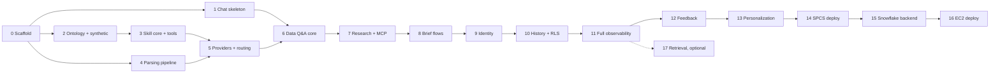

# 08 — Phased Build Plan

Discipline: every phase ends with something runnable and validatable. No phase depends on a
later one. Tests ship inside the phase that introduces the behavior (never deferred, never
gitignored). Suggested branch-per-phase; merge only after the gate passes.

Shape of the plan: conversational **data Q&A is an early core phase** (P6 — the first
end-to-end LLM capability); the **SPCS deploy (P14) precedes EC2 (P16)**; the **Snowflake data
backend comes online at user testing (P15)**; personalization (P13) and feedback (P12) land
before user testing so testers exercise them.

## Phase 0 — Scaffold and toolchain

- Deliverables: monorepo layout (doc 00 §6, incl. `backend/poseidon/mcp/`); FastAPI hello + `/health/*`;
  Vite shell; docker-compose (Postgres+pgvector, MinIO); Alembic baseline; lint/format; pytest +
  vitest harnesses each with one real test; `.env.example`; pydantic-settings validation
  (crash-on-missing) covering the full contract of doc 07 §6.
- Validate: `docker compose up` serves both apps; `pytest` and `npm test` green; killing a
  required env var makes the backend refuse to start.
- Depends on: nothing.

## Phase 1 — Chat skeleton with mock responses

- Deliverables: chat UI (doc 01): sidebar, composer, message stream, flow entry (bubbles as
  optional chips + live composer), skills-picker stub, renderer registry with
  `text`/`chips`/`tool_event`/`error`; SSE endpoint streaming a scripted mock turn including
  `tool` events rendered as visible steps; mocked feedback affordance (thumbs + comment UI);
  MSW handlers mirroring the API.
- Validate: a mock turn shows streamed text **and** step lines ("Calling … ✓ done"); thumbs-down
  opens the comment prompt (stored in mock); renderer fallback test; SSE reducer tests green.
- Depends on: 0.

## Phase 2 — Ontology loader and synthetic data

- Deliverables: vendored `ontology.yml` + typed loader; inventory contract test; synthetic
  profiles + seeded generator; `synthetic` schema loaded at compose-up; `SyntheticDataClient`
  (dimension values, periods, metric + breakdown queries); query builder with SQL snapshot
  tests (both dialect hooks).
- Validate: `pytest` — loader pins entities/metrics; generator determinism (same seed, same
  checksums); the six certified metrics for prior-year vs YTD and a Singapore-style breakdown
  (top customers by GP for one port and month) return correct values from synthetic data.
- Depends on: 0.

## Phase 3 — Skill framework + deterministic tools (no LLM yet)

- Deliverables: task/skill registry with discovery + fail-fast validation (doc 02 §2);
  `SkillContext`/`SkillResult`; `data_qa.metric_query` tools (metric/breakdown/top-N specs →
  parts + proof); `customer_insight` brief tools (`fetch_metrics`, `fetch_top_ports`,
  `build_brief_pdf` to MinIO); registry↔schema parity test; dev-only skill runner endpoint.
- Validate: `pytest` — tool goldens against seeded synthetic data; the Singapore breakdown runs
  via the dev runner and returns a `table` part + proof block; PDF artifact lands in MinIO.
- Depends on: 2.

## Phase 4 — Deterministic parsing pipeline

- Deliverables: `normalize`, `period_parser` (carry-over + availability validation),
  `customer_resolver` (3-tier fuzzy), `skill_hinter`; `ParsedTurn`; slot-state carry semantics
  (omit/clear/replace); exact-value pass-through store.
- Validate: table-driven pytest suites — date phrases, misspelled customers, carry truth table,
  port/entity carry for later pivots; all offline.
- Depends on: 0 (uses `DataClient` fixtures; joins 2 when merged).

## Phase 5 — LLM provider layer + routing

- Deliverables: the provider contract (doc 03 §1) with **`BedrockProvider`
  (Converse/ConverseStream) and the stub provider only** — `CortexProvider` is deliberately
  deferred to Phase 14 (decision D33); `RoleClient` + `models.yml` profiles (both profiles
  declared, `cortex` unusable until 14); `PromptRegistry` with prompt assembly order (base → user
  instruction → memory → state); agent loop with validation, structured error return, iteration
  cap, `tool` event emission; `StubRouter`; utility role for titles; router-decision suite (stub +
  `-m router_live`); prompt contract tests.
- Validate: stub-mode loop tests green offline; live smoke on Bedrock routes "top GP customers for
  Port of Singapore in April 2026" to `data_qa.metric_query` with correct args; swapping
  `LLM_MODE=stub` changes no calling code (the seam is proven by substitution, not by a second
  live provider).
- Depends on: 3, 4.

## Phase 6 — Conversational data Q&A, end to end (core)

- Deliverables: the default flow live in the chat: parse → route → `data_qa.metric_query` →
  streamed `table`/`metric_grid` parts + proof + verbose tool steps; clarification chips;
  carry-over follow-ups ("and for May?", "same for Rotterdam") using conversation state;
  skills picker wired to the real registry; **the minimal run-log writer** — `turn_run` +
  `llm_calls` + `tool_calls` migrations and the provisional-insert/append/finalize writer (doc 06
  §1), so every live turn is recorded from the first end-to-end conversation onward. Logging
  arrives with the first live LLM call, not after it.
- Validate: scripted conversation on synthetic data — Singapore top-GP question, two carry-over
  pivots, one ambiguous customer resolving via chips; router-decision cases for each; E2E
  pytest with stubbed LLM; Playwright smoke; **inspect the rows written by that scripted
  conversation** — one `turn_run` per turn with terminal status and token roll-up, one `llm_calls`
  row per model invocation (router iterations included) with provider/model/prompt version, one
  `tool_calls` row per tool with validated args.
- Depends on: 1, 5.

## Phase 7 — Web research skill + MCP layer

- Deliverables: `backend/poseidon/mcp/` registry + Perplexity direct adapter (schemas ported, truncated-
  JSON recovery) and MCP-transport client behind `TOOL_TRANSPORT_PERPLEXITY`;
  `research.web_research` skill with the marine-industry lens; verbose `tool_event` labels;
  pivot routing (internal answer → "any relevant news on customer X?").
- Validate: default-flow conversation pivots from a data answer to live (or recorded) research
  with visible steps; transport flip via env produces identical `SkillResult` shape (contract
  test); router-decision pivot cases green.
- Depends on: 6.

## Phase 8 — The two brief flows, end to end

- Deliverables: subskills `contextualize`, `research`, `strategize` with prompts-as-config;
  deterministic first-turn dispatch for bubble entries (D19); concurrent contextualize+research
  for existing mode; phase streaming into `phase_section`/`metric_grid`/`table`/`artifact`
  parts; prospect flow (D10 ordering); post-brief pivots into `data_qa`/`research` with carried
  entities.
- Validate: full existing-customer and prospect conversations on synthetic data, each followed
  by one internal and one external pivot answered correctly; progressive display verified; E2E
  pytest with fixtures; Playwright smoke through all three flows.
- Depends on: 7.

## Phase 9 — Identity providers

- Deliverables: `IdentityProvider` seam (doc 05 §2): `auth0` (PKCE SPA + JWKS middleware +
  roles claim), `disabled` (dev user + `X-Dev-User`), and `spcs_ingress`
  (`Sf-Context-Current-User` mapping, active only when `DEPLOY_MODE=spcs`) — all three
  implemented now, config-selected; CORS allowlist; rate limit on chat POST.
- Validate: login round-trip on the dev tenant; role-less user gets 403 problem-detail;
  tampered/expired token 401 (local JWKS fixture); `spcs_ingress` unit tests (header mapping,
  rejection outside SPCS mode); `disabled` mode still boots.
- Depends on: 8 (UI shell), usable earlier if parallelized.

## Phase 10 — Chat history + RLS

- Deliverables: `conversations`/`messages` migrations (UUIDv7, doc 05 §6); RLS policies +
  non-owner app role + `FORCE ROW LEVEL SECURITY`; the transaction-scoped `set_config` context
  wrapper (D28); list/resume/continue APIs (cursor pagination); state snapshot restore into the
  parser; sidebar on real data.
- Validate: the four required RLS tests of doc 05 §4 — two-user isolation, no-context connection
  sees none, **pooled-connection context leak** (two sequential checkouts of one connection under
  different users), and owner-bypass filtered; reopen a conversation and continue with a
  carry-over question answered from restored state.
- Depends on: 9.

## Phase 11 — Full observability

The tables and the writer already exist from Phase 6; this phase makes them useful.

- Deliverables: RLS on `turn_run`/`llm_calls`/`tool_calls` and the `admin` read role (doc 05 §4,
  §7); `kind='memory_update'` runs accounted for; trace-id propagation + JSON logging; reconnect
  reconciliation `GET /api/turns/{id}` rebuilt from `turn_run` + children + `messages`;
  `scripts/export_router_cases.py`; cost roll-up query over `llm_calls` (by user/day/model/role/
  prompt version) + the token-spike check; the redaction path for conversation deletion (doc 05
  §7).
- Validate: kill the SSE mid-turn and reconcile from the stored turn; export one real turn into
  the router-decision suite (the harvest loop demonstrably closed); cost roll-up returns per-call
  attribution for a multi-iteration turn; deleting a conversation leaves a redacted `turn_run`
  with its ids, tokens, and status intact and its payload columns null.
- Depends on: 10.

## Phase 12 — Feedback capture

- Deliverables: `message_feedback` table (doc 06 §7) + RLS; `POST /api/messages/{id}/feedback`
  (idempotent upsert); thumbs + "what went wrong" UI wired live; harvest extension —
  thumbs-down rows exported first with run context and comment; verdict roll-up query.
- Validate: up/down/amend round-trips persist and enforce one-verdict-per-user; a thumbs-down
  with comment exports into a candidate router-decision case carrying the run context.
- Depends on: 11.

## Phase 13 — Personalization

- Deliverables: `user_profile` + `user_memory` + `memory_outbox` migrations (RLS, typed attributed
  entries, size cap on the rendered form, versioning — doc 05 §5); prompt assembly renders entries
  to markdown and injects instruction + memory (doc 03 §3); settings surface (doc 01 §9: edit
  instruction, review/delete entries, restore versions); `memory` role + the **outbox worker**
  (idle threshold, retries, D31) logged as `turn_run.kind='memory_update'`.
- Validate: set an instruction ("always show GP in USD k") and see it obeyed in the next answer;
  leave a conversation idle past `MEMORY_IDLE_MINUTES` and watch a new memory version appear with
  its `turn_run` row; restart the worker with a pending outbox row and confirm the job still runs
  (durability, the point of D31); every stored entry carries a type and a source conversation;
  restore a prior version; size cap rejects an oversized write with a clear error.
- Depends on: 12.

## Phase 14 — SPCS deployment (primary target)

- Preparation deliverables (before the deploy work): **`CortexProvider`** (strict-JSON tool
  emulation) behind the unchanged contract of doc 03 §1, plus the **provider-parity contract
  test** — recorded tool-calling scenarios normalizing to identical `ToolCall`/`LLMResponse`
  shapes on Bedrock and Cortex (decision D33); the router-decision suite re-run with
  `LLM_PROFILE=cortex`.
- Deliverables: multi-stage Dockerfile (doc 07 §2); `infra/spcs_spec.yaml` (backend + db +
  minio containers, block volumes, public `api` endpoint); image repo + compute pool + EAI
  setup; `DEPLOY_MODE=spcs` session strategy live (OAuth token file); `IDENTITY_MODE=
  spcs_ingress` live; Cortex profile as LLM default; scheduled `pg_dump` + artifact mirror
  shipped off-service (doc 07 §4); `infra/runbooks/deploy-spcs.md` and
  `infra/runbooks/backup-restore-spcs.md`.
- Validate: service READY; `SHOW ENDPOINTS` yields the ingress URL; `smoke.md` executed there —
  login-as-Snowflake-user, all three flows on synthetic data, artifact download, `turn_run` +
  `llm_calls` + feedback rows present, memory distillation fires (idle threshold lowered for the
  rehearsal); parity test green on the Cortex default; suspend/resume rehearsed; rollback
  (`alembic downgrade` + previous image tag) rehearsed; **restore rehearsed** — a verified dump
  restored into a fresh service and smoked, against the stated RPO/RTO. **This gate opens user
  testing.**
- Depends on: 13.

## Phase 15 — Snowflake data backend online

- Deliverables: `SnowflakeDataClient` live against the certified views (`MARINE_SALES_
  PLANNING_V`, `W_MARINE_GL_SOURCE_AI`); `DATA_BACKEND=snowflake` flipped in the SPCS
  environment; dialect snapshots verified; period availability + dimension values served from
  live data.
- Validate: parity check — the certified-metric suite runs against both backends and agrees on
  shape and semantics; the Singapore-style breakdown returns live numbers with a proof block
  naming `snowflake` as source; user testing proceeds on real data.
- Depends on: 14.

## Phase 16 — EC2 deployment (secondary target)

- Deliverables: provisioning scripts + `infra/runbooks/deploy-ec2.md` (doc 07 §5); EC2 + Caddy
  TLS + static frontend; RDS with migrations + synthetic load; S3 + lifecycle; instance
  profile; `IDENTITY_MODE=auth0` with prod-tenant URLs; `LLM_PROFILE=bedrock`; Budget alarm.
- Validate: `smoke.md` executed on the public URL — login, all three flows, artifact download,
  `turn_run` row present; optional `DATA_BACKEND=snowflake` flip verified; rollback rehearsed.
- Depends on: 13 (independent of 14/15; sequenced after SPCS by decision D8).

## Phase 17 — Retrieval (thin slice, optional)

- Deliverables: `embeddings` table (pgvector, RLS); config-driven `embeddings` role; index
  briefs/research on completion; a `find_prior_insight` tool + one router-decision case.
- Validate: generate two briefs, ask "what did we say about <customer> before" — the prior
  brief chunk returns; similarity unit test with fixed vectors.
- Depends on: 11 (schedulable any time after; not a gate for either deploy).

## Cut-over criteria for the legacy app

The Streamlit app is retired only when: all three flows verified in the new chat **on SPCS
against the same backing data** (post-P15); PDF parity accepted; identity behavior verified in
the deployed mode; run-log auditability and feedback capture demonstrated. Until then the repos
coexist untouched.
